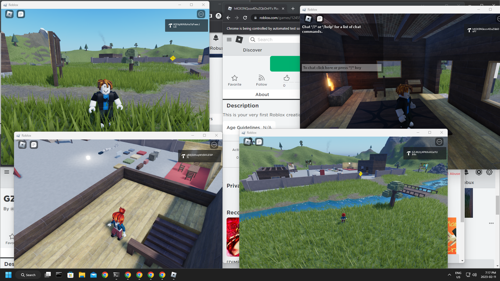

# roblox_multi_instance

Allows you to open multiple Roblox clients.

## Instructions

### How To Use

* Just run `roblox-multi-instance.exe` and keep it open in the background.

### Things To Note

* All Roblox instances need to be closed before running this program. Otherwise, it will not work.
